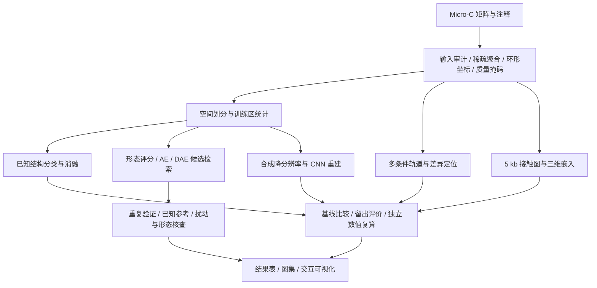
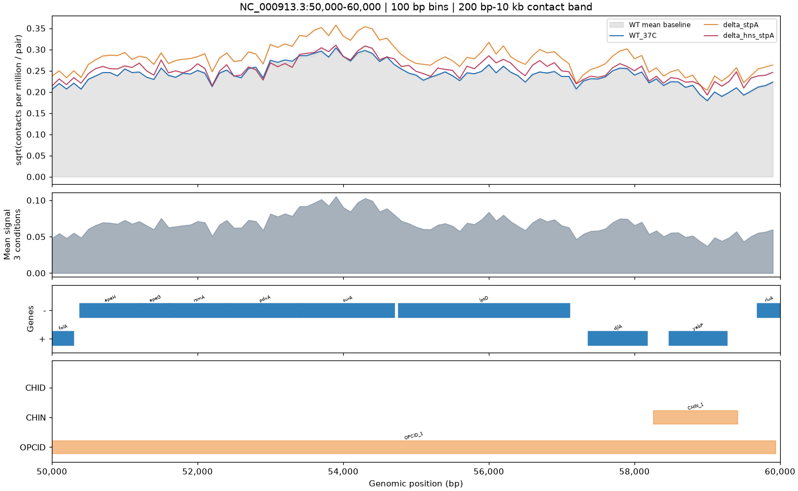
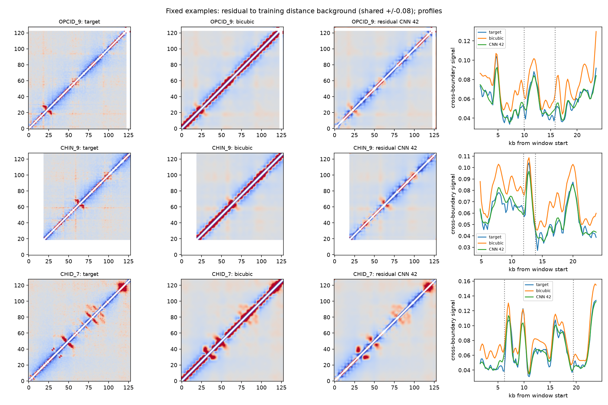
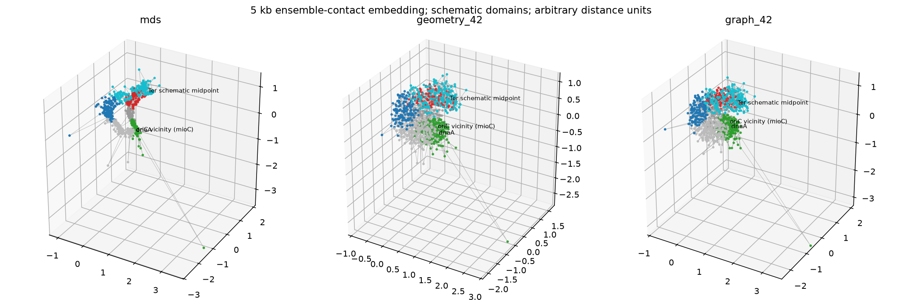

# MicroCTure：基于 Micro-C 接触矩阵的结构识别、重建与可视化

**Structure Recognition, Reconstruction, and Visualization of Micro-C Contact Maps**

[English](README.en.md) · [交互可视化](site/index.html) · [技术设计](docs/PROJECT.md) · [结果摘要](docs/RESULTS.md) · [复现指南](docs/REPRODUCIBILITY.md)

## 摘要

MicroCTure 是一个面向大肠杆菌 Micro-C 数据的可复现分析项目，研究如何从高分辨率染色体接触矩阵中识别局部结构、检索未注释模式、比较条件差异，并进行超分辨率与三维空间重建。项目基于公开数据集 GSE272159，构建了从稀疏数据处理、空间隔离划分、模型训练到独立评价与交互可视化的完整流程。

已完成的工作包括：已知结构分类与消融实验、基于形态特征和自编码器的候选发现、多条件全基因组轨道、已知结构差异定位、800 → 200 bp 合成超分辨率重建，以及 5 kb 分辨率的全基因组三维接触嵌入。实验使用简单基线、多随机种子、跨重复评价与独立数值复算，分别考察模型性能、结构恢复和结果稳定性。

主要结果为：双尺度分类模型的测试 macro-F1 为 **0.501 ± 0.099**；残差 CNN 的合成超分辨 PSNR 为 **34.332 ± 0.172 dB**，高于双三次插值的 **24.238 dB**；图解码器的留出对数距离 RMSE 为 **0.307**，低于 MDS 的 **0.461**。同时，超分辨边界定位未同步改善，三维接触相关仍低于 MDS，候选检索尚未确认新的结构类型。这些结果表明，图像质量、几何拟合与生物学结构恢复需要分别评价。

**关键词：** Micro-C；染色体接触矩阵；空间隔离评价；卷积神经网络；自编码器；超分辨率；三维重建。

## 1. 研究目标与工作范围

接触矩阵的元素表示两个基因组区间之间的接触计数。其局部模式受到结构形态、基因组距离、测序深度和低覆盖区域的共同影响。因而，仅训练分类器或观察聚类分离，不能直接回答结构是否真实、是否可重复，以及是否属于新的类型。

本项目围绕以下六项工作组织实现与评价：

| 工作模块 | 研究问题 | 主要产出 |
|---|---|---|
| 已知结构识别 | 局部矩阵能否区分 OPCID、CHIN 和 CHID？ | 分类模型、基线、消融、混淆矩阵与解释分析 |
| 未注释模式检索 | 哪些模式在重复实验中可复现，并与已知结构有何关系？ | 候选坐标、聚类、重复一致性及形态核查 |
| 多轨道可视化 | 接触信号如何对应基因、结构注释及实验条件？ | 覆盖全基因组的 465 页多轨道图 |
| 条件差异定位 | 已知结构在不同处理条件下如何变化？ | 688 次结构比较及配套热图 |
| 超分辨率重建 | 低分辨率输入能否恢复高分辨率信号与局部结构？ | 重建矩阵、CNN 权重、插值对照及结构恢复评价 |
| 三维接触嵌入 | 接触频率能否约束全基因组相对空间分布？ | 三维坐标、反算接触图、基线评价及交互视图 |

本项目的主要实现工作是数据处理、模型比较和评价流程的集成。所使用的 CNN、自编码器、MDS 等属于已有方法范畴；本仓库不将流程集成表述为新的通用模型架构，也不将探索性候选表述为已确认的生物学发现。

## 2. 数据与预处理

### 2.1 数据来源与规模

Micro-C 数据来源于 [GSE272159](https://www.ncbi.nlm.nih.gov/geo/query/acc.cgi?acc=GSE272159)，相关研究见 [Elementary 3D organization of active and silenced E. coli genome](https://doi.org/10.1038/s41586-025-09396-y)。结构与基因注释由配套表格整理得到。

| 项目 | 数据说明 |
|---|---|
| 参考基因组 | *Escherichia coli* MG1655，`NC_000913.3` |
| 染色体长度 | 4,641,652 bp |
| 原始分辨率 | 10 bp；464,166 个 bin |
| WT 重复 | 37°C rep1、rep2 |
| WT 稀疏记录数 | 257,522,134 与 249,673,544，合计约 5.07 亿条 |
| 条件比较 | WT、ΔstpA、ΔhnsΔstpA，每条件两个重复 |
| 已知结构 | 344 条：OPCID 68、CHIN 250、CHID 26 |
| 基因轨道 | 4,516 条整理后的基因记录；未声称为完整参考注释 |

这里的稀疏记录数是存储的非零接触对数量，不等于测序 reads 数或总接触计数。输入获取方式、样本名称和文件路径见 [数据说明](data/README.md)。

### 2.2 稀疏处理与归一化

原始全基因组矩阵若直接转换为 float32 稠密数组，单份约需 **862 GB**（十进制）。因此，预处理采用 HDF5 分块扫描、稀疏计数聚合、局部接触带缓存和按需切窗；仅在三维模块降至 5 kb 后，构建 929 × 929 的全基因组稠密矩阵。

处理流程包括：

1. 核查样本、参考序列、bin 坐标及计数完整性，保留来源与输入签名。
2. 按目标分辨率聚合数值计数，支持环形染色体跨原点窗口。
3. 保留有效像素掩码，对低覆盖区域及不完整末端分箱显式处理。
4. 根据任务使用文库深度归一化、`log1p` 变换或距离背景校正 O/E。
5. 计算距离背景时包含零计数接触机会，避免只对非零像素求均值产生偏差。

深度归一化用于改善样本间相对可比性；O/E 用于减弱接触随基因组距离衰减的背景。两者含义不同，不视为可以互换的变换。模型所需的拟合统计由训练区域估计；不同实验的具体处理见配置与复现文档。

### 2.3 空间划分与泄漏控制

分类与超分辨实验沿用同一结构级空间划分：

| 集合 | OPCID | CHIN | CHID | 合计 |
|---|---:|---:|---:|---:|
| 训练 | 47 | 175 | 18 | 240 |
| 验证 | 11 | 36 | 4 | 51 |
| 测试 | 10 | 39 | 4 | 53 |

划分在切窗与增强前完成，以最大窗口的基因组足迹构建分组，跨集合保留 **1 kb 隔离带**。同一结构的生物学重复与增强版本保持相同角色，避免高度重叠图像分别进入训练和测试。

分类以结构为评价单位，对重复的预测概率先取平均。超分辨训练与选模仅使用 rep1，随后在测试位置分别评价 rep1、rep2。候选发现使用独立的基因组块划分；三维重建采用接触边留出。这几种划分回答的问题不同，不能将边留出或重复一致性等同于新生物样本上的独立验证。

## 3. 方法与实现



### 3.1 已知结构分类与消融

分类输入由 100 bp 局部矩阵构成。小、大物理窗口分别为 **6.4 kb 与 25.6 kb**，转换为固定大小的 64 × 64 张量；输入包含信号及有效像素比例。主模型 M2 使用共享编码器提取双尺度特征，在分类头融合局部形态与较大范围上下文。

卷积编码器采用 16 / 32 / 64 通道、GroupNorm、ReLU 和池化。训练使用 AdamW、训练集类别权重及验证集结构级 macro-F1 选模。考虑 CHID 数量较少，主要指标采用 macro-F1，同时报告准确率、每类表现与种子波动。

| 标识 | 方法或变化 | 用途 |
|---|---|---|
| B0 | 训练集多数类预测 | 衡量类别不平衡带来的表面准确率 |
| B1 | 结构长度、局部密度 + Logistic Regression | 检查长度与密度捷径；长度来自注释，是特权信息 |
| B2 | 大尺度 O/E 展平、训练区 PCA(16) + Logistic Regression | 线性图像基线 |
| M1 / A2 | 仅大尺度 CNN | 单尺度基线；A2 复用 M1，不重复计数 |
| M2 | 共享编码器双尺度 CNN | 主模型 |
| A1 | 仅小尺度输入 | 检验较大范围上下文的作用 |
| A3 | 深度归一化输入替代 O/E | 检验距离背景校正的作用 |
| A4 | 均匀类别权重 | 检验类别加权的作用 |
| A5 | 移除显式掩码通道，保留无效信号为零 | 检验缺失性信息的影响 |

六个不同 CNN 设置分别运行种子 42、43、44，共 18 次训练。模型解释与遮挡分析用于检查判别依据；它们不作为模型已经识别出生物学机制的证明。

### 3.2 候选发现与形态证据核查

候选检索从沿对角线的多尺度滑窗出发，比较形态评分、自编码器（AE）、去噪自编码器（DAE）及融合评分。第二轮包括 AE / DAE 各三个种子，共 6 次训练、14 种评分配置；聚类比较 4 个 K 值和 3 个聚类种子，共 168 次运行。

评价在匹配候选预算下进行，同时保留已知结构以估计检索覆盖。候选合并为独立位点后，在同坐标读取另一重复，计算排除无效像素和近对角线区域的形态一致性，并与匹配背景比较。

后续核查对未知窗口与已知参考使用相同处理，包括固定重新居中、多尺度、平移和遮挡敏感性，并检查行效应去除与多个已知参考。最终分析覆盖 **21 个独立候选、63 次多参考比较**。该模块旨在区分“未注释”“可复现”“统计异常”和“新的结构类型”，不以增加新簇数量作为参数选择目标。

### 3.3 全基因组多轨道可视化

三条件共六个样本统一聚合到 100 bp，使用共同有效 bin。每个位点汇总与其相隔 200 bp–10 kb 的有效接触，按文库总量及有效接触伙伴数归一化。

按 10 kb 页面连续覆盖全基因组，共生成 **465 页**。轨道包括各条件及重复信号、条件平均信号、基因位置与链方向、已知结构注释。可视化中的平方根变换仅用于展示，不进入差异效应计算。



*图 1. 固定 10 kb 区间的多条件轨道示例。不同页面纵轴可自动缩放，跨页比较应使用数值而非曲线视觉高度。*

### 3.4 条件差异定位

在已知结构内部，使用六样本共同有效的接触对计算平均深度归一化信号。每个处理条件相对 WT 比较一次，共 **344 × 2 = 688 次比较**。

主效应量定义为：

$$
\Delta = \log_2\frac{\overline{s}_{\mathrm{treated}}+0.01}{\overline{s}_{\mathrm{WT}}+0.01}.
$$

两处理重复与两 WT 重复构成四种交叉比较。全部比值大于 1.5 判为增强，全部小于 1/1.5 判为减弱；同时要求至少 20 个有效接触对、有效比例至少 80%。该规则用于描述性筛选，不计算 p 值或 FDR，也不假设不同条件下的同编号重复为配对样本。

### 3.5 合成超分辨率重建

使用固定 25.6 kb 窗口，将 100 bp 数值缓存聚合为 **128 × 128 的 200 bp 目标**，再合并为 **32 × 32 的 800 bp 输入**。因此，该实验研究的是 Micro-C 自身的四倍合成超分辨，而非真实 Hi-C 到 Micro-C 的跨模态转换。

比较双线性、双三次插值、残差 CNN 与去残差 CNN。两个 CNN 均由三层卷积构成，分别运行三个种子，使用相同划分、训练预算、学习率和掩码损失，最多训练 30 轮，按验证损失选择 checkpoint。残差模型预测双线性上采样后的修正量，输出与转置平均以保持对称。

评价包含两个层面：

- **图像层面：** 在固定归一化范围 [0,1] 上计算 PSNR，以及完整有效 7 × 7 局部窗口上的 SSIM；只评价上三角并排除距离不足 400 bp 的像素。
- **结构层面：** 比较跨边界接触剖面，以及注释边界固定邻域内重建与观测剖面谷值的位置偏差；另外按基因组距离分层检查误差。

边界指标利用已知位置，是辅助恢复评价，不是全基因组盲检测精度。两个 CNN 的末层初始化亦有差异，因此消融比较的是完整残差训练方案，不能把差异全部归因于连接形式。



*图 2. 每类第一个测试结构的固定示例。热图减去训练区平均距离背景，使用共同色标；曲线比较观测目标、双三次插值与固定种子 CNN。示例未按模型表现筛选。*

### 3.6 全基因组三维接触嵌入

两个 WT 重复分别流式聚合到 5 kb，得到 **929 个基因组节点**；聚合保持原始上三角总计数守恒，末端不完整分箱按实际长度修正暴露量。

rep1 非相邻上三角接触边按固定种子划分为训练、验证和测试；rep2 不参与拟合或选模。接触频率按固定关系转换为相对目标距离：

$$
d_{ij}^{\mathrm{target}}=\frac{(C_{ij}+0.5)^{-1/3}}{s_{\mathrm{train}}},
$$

其中 $s_{\mathrm{train}}$ 为训练边转换距离的中位数。该幂律是建模假设，未进行实际空间长度标定。

方法包括：

1. **经典 MDS：** 已知距离来自训练边，缺失边由训练区按环形基因组距离估计的背景填补，并仅使用训练边校正整体尺度。
2. **距离几何优化：** 从 MDS 坐标加微小扰动出发，直接优化节点坐标。
3. **残差图解码器：** 结合 MDS 初始坐标、环形位置特征、32 维可学习节点嵌入及训练接触图聚合，预测三维坐标修正。

后两种方法各运行三个种子，优化对数距离误差与环形相邻约束，并按验证误差选模。评价同时报告留出距离 RMSE、反算接触 Pearson / Spearman、距离层内相关与种子稳定性。宏观结构域示意标签仅用于展示与事后核查，不参与训练。



*图 3. 三种方法的相对三维嵌入示例。颜色表示近似宏观域注释；连线包含环形先验。坐标不具有纳米单位，图形本身不证明真实单细胞构象。*

## 4. 定量结果

以下数值来自保存的结果表。对于三个训练种子的模型，± 表示种子间标准差，不是生物学置信区间。

### 4.1 分类结果

| 模型 | 测试 macro-F1 | 测试准确率 |
|---|---:|---:|
| B0：多数类 | 0.283 | 0.736 |
| B1：长度与密度 | 0.462 | 0.566 |
| B2：PCA 线性模型 | 0.424 | 0.623 |
| M1：大尺度 CNN | 0.340 ± 0.041 | 0.516 |
| M2：双尺度 CNN | **0.501 ± 0.099** | 0.667 |
| A1：仅小尺度 | 0.371 ± 0.022 | 0.535 |
| A3：深度输入替代 O/E | 0.433 ± 0.077 | 0.522 |
| A4：均匀类别权重 | 0.424 ± 0.111 | 0.679 |
| A5：无显式掩码通道 | 0.332 ± 0.027 | 0.484 |

M2 的平均 macro-F1 在这组实验中最高，但种子波动明显，CHID 留出样本仅 4 个。多数类基线具有较高准确率，说明单独报告准确率不足以评价三类识别能力。B1 使用注释长度，不能视为与纯矩阵模型完全相同的信息条件。

[原始分类结果表](showcase/results/task1/comparison.csv) · [分类与消融图](showcase/results/task1/comparison.png)

### 4.2 超分辨结果

| 方法 | rep1 PSNR / dB ↑ | rep1 SSIM ↑ | rep2 PSNR / dB ↑ | rep1 边界偏差 / bp ↓ |
|---|---:|---:|---:|---:|
| 双线性 | 23.382 | 0.925 | 23.934 | 196.2 |
| 双三次 | 24.238 | 0.934 | 24.779 | **177.4** |
| 残差 CNN | **34.332 ± 0.172** | **0.954** | **34.193 ± 0.129** | 227.0 |
| 去残差 CNN | 33.908 ± 0.483 | 0.947 | 33.742 ± 0.427 | 235.2 |

残差 CNN 的整体图像指标提高，但边界偏差高于双三次插值。事后距离分层诊断进一步显示，收益主要集中在近对角线，而非所有距离区间都一致改善。因此，PSNR 提升不能直接解释为结构定位提升。

[逐类汇总](showcase/results/task5/summary.csv) · [逐窗口结果](showcase/results/task5/metrics.csv) · [距离分层诊断](showcase/results/task5/distance_diagnostics.csv)

### 4.3 三维嵌入结果

| 方法 | rep1 对数距离 RMSE ↓ | rep2 对数距离 RMSE ↓ | rep1 接触 log-Pearson ↑ | rep1 距离层内相关 ↑ |
|---|---:|---:|---:|---:|
| MDS | 0.461 | 0.461 | **0.919** | **0.826** |
| 距离几何 | 0.309 | 0.308 | 0.852 | 0.637 |
| 残差图解码器 | **0.307** | **0.306** | 0.851 | 0.627 |

图模型降低了所优化的距离误差，但接触相关及距离层内相关低于 MDS，反映了评价目标之间的取舍。不能仅依据距离误差下降宣称三维重建全面更准确。

[完整三维评价表](showcase/results/task6/metrics.csv) · [反算接触图](showcase/results/task6/contact_maps.png) · [宏观域核查](showcase/results/task6/domain_geometry.csv)

### 4.4 候选与条件比较结果

第二轮形态基线选出的 189 个窗口中，82 个通过重复门槛，其中 21 个未注释；AE / DAE 的纯残差评分未选出通过门槛的窗口。经独立位点整理与后续形态核查，当前仍未确认满足预设规则的新结构类型。

条件比较中，ΔstpA 有 10 个、ΔhnsΔstpA 有 94 个已知结构满足描述性变化规则。这些结果反映文库归一化后的相对接触变化，不等同于绝对接触增加、结构形成或因果机制。

[发现方法汇总](showcase/results/task2_v2/method_summary.csv) · [独立未注释窗口](showcase/results/task2_v2/unannotated_supported_disjoint.csv) · [多参考形态对照](showcase/results/task2_morphology_audit/comparisons/w64_c43040.png) · [条件变化汇总](showcase/results/task4/summary.csv)

## 5. 可复现性与验证

项目保留了以下工程与实验约束：

- **配置与来源追踪：** 模型、划分与筛选规则集中于 `configs/`，实验 manifest 记录源码与输入签名。
- **完整对照：** 共 36 次训练或几何拟合，包括 18 次分类 CNN、6 次 AE / DAE、6 次超分辨 CNN 和 6 次三维优化；168 次聚类单独统计。
- **独立结果复算：** 从保存的矩阵和坐标重新计算指标，恢复 12 个超分辨 / 三维 checkpoint，核对预测或坐标一致性。
- **合成单元测试：** 46 项测试覆盖坐标、掩码、计数守恒、空间隔离、损失、梯度和几何重建，不要求原始数据。
- **轻量展示：** 23 个精选结果文件按字节导出，并附 [SHA256 清单](showcase/results/manifest.json)。

验证记录见 [超分辨与三维核验](reports/task56_verification.json) 和 [多条件核验](reports/task34_verification.json)。GitHub Actions 已配置，远端状态应以实际运行结果为准。

## 6. 使用方法

### 6.1 浏览交互结果

仅需 Python 标准库，不需要原始矩阵或训练依赖：

```bash
git clone https://github.com/PPEE523/MicroCTure.git
cd MicroCTure
python3 -m http.server 8000
# 浏览器打开 http://localhost:8000/site/
```

[交互页面](site/index.html)提供超分辨拖动对比，以及七组三维坐标的旋转、缩放与模型切换。GitHub 文件页本身不执行 HTML。

### 6.2 安装环境与运行测试

已记录的实验环境为 Linux、Python 3.14 与 CPU PyTorch：

```bash
python3.14 -m venv .venv
.venv/bin/python -m pip install -r requirements-training.txt --extra-index-url https://download.pytorch.org/whl/cpu
make test
make check
```

### 6.3 复现完整实验

完整运行需要按 [数据说明](data/README.md) 准备 WT 矩阵、条件数据和注释。按依赖顺序执行预处理、分类、发现与核查、条件分析、超分辨和三维模块。全部命令、缓存前提与重新执行规则见 [复现指南](docs/REPRODUCIBILITY.md)。

原始输入、权重、缓存和完整运行产物不随代码提交。已有阶段报告与作业图集继续保留在本地，仅通过 `.gitignore` 控制公开范围。

## 7. 仓库组织

| 路径 | 内容 |
|---|---|
| [scripts/](scripts/) | 数据预处理、模型训练、报告生成、独立核验与展示构建 |
| [configs/](configs/) | 数据划分、模型参数、评价规则及导出清单 |
| [tests/](tests/) | 使用合成输入的数学与数据完整性测试 |
| [data/](data/README.md) | 数据来源、元信息与小型注释派生表 |
| [reports/](reports/README.md) | 公开的机器可读结果与核验摘要 |
| [showcase/](showcase/README.md) | 精选数值表、图像和三维 HTML |
| [site/](site/) | 交互可视化页面 |
| [docs/](docs/README.md) | 技术设计、结果摘要与复现方法 |

科学分析脚本保留既有文件名，便于对照运行记录与源码签名。

## 8. 局限与后续研究

1. **注释与样本量。** 原始坐标约定仍标记为 `provisional`；类别分布不均衡，少数类测试样本很少，限制了性能估计的稳定性。
2. **探索性数据复用。** 后续实验使用已被查看的 WT 重复。空间隔离减轻局部像素泄漏，但不能恢复为新的盲测或独立生物学验证。
3. **候选发现范围。** 首版搜索以沿对角线的局部窗口为主；未注释、聚类稳定或重复一致均不足以单独确立新的生物学结构类型。
4. **超分辨退化模型。** 当前采用合成 bin 合并和归一化截断，不能代表真实低深度实验或跨模态差异；图像增益尚未转化为边界定位优势。
5. **三维可辨识性。** 群体接触图与固定接触–距离关系无法唯一确定单细胞构象。环形约束和宏观域示意应与观察证据区分，真实宏观形态尚未验证。
6. **条件差异解释。** 每条件仅两个重复；当前效应量为描述性结果，未建立显著性模型，也未将处理与批次影响完全分离。

后续可在独立数据上评价跨条件泛化，使用更贴近测序过程的退化模型检验结构恢复，并结合外部空间约束与不确定性估计开展三维验证。这些属于后续研究方向，不计入本仓库已完成的结果。

## 9. 数据来源、引用与许可

- 原始数据：[NCBI GEO — GSE272159](https://www.ncbi.nlm.nih.gov/geo/query/acc.cgi?acc=GSE272159)。
- 相关研究：[Elementary 3D organization of active and silenced E. coli genome](https://doi.org/10.1038/s41586-025-09396-y)。
- 本项目引用信息：[CITATION.cff](CITATION.cff)。

本仓库为独立数据再分析与方法实现，不是原始研究团队的官方代码。代码使用 [MIT License](LICENSE)；原始数据、第三方注释和其他材料保留各自的许可与权利。贡献约定见 [CONTRIBUTING.md](CONTRIBUTING.md)。
