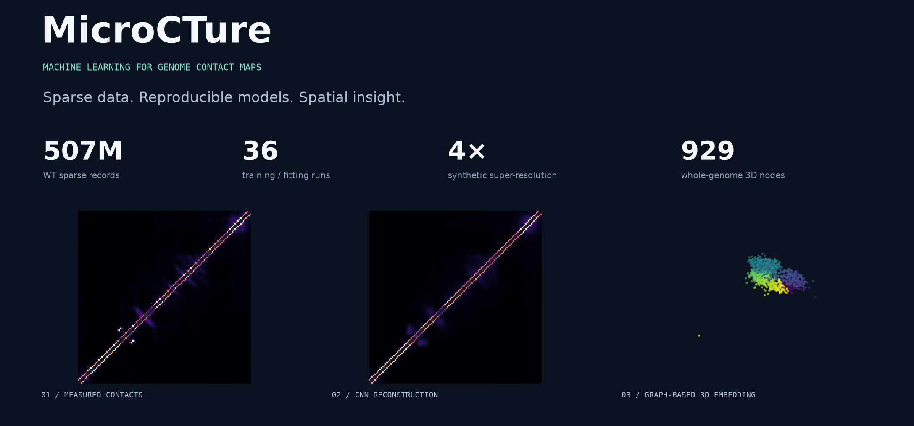

# MicroCTure

**面向基因组接触矩阵的机器学习与三维可视化流水线。**

[English](README.en.md) · [交互展示](site/index.html) · [技术设计](docs/PROJECT.md) · [实验结果](docs/RESULTS.md) · [复现指南](docs/REPRODUCIBILITY.md)



将 **5 亿级稀疏记录**转换为可训练的数据集，完成结构分类、候选发现、超分辨重建与三维图建模，再用对照实验、跨重复评价和交互视图验证结果。

`Python` · `PyTorch` · `NumPy / SciPy` · `HDF5 / Cooler` · `Scientific ML` · `GitHub Actions`

## 30 秒看懂这个项目

| 数据工程                                  | 模型与实验                         | 可视化与交付                                 |
| ----------------------------------------- | ---------------------------------- | -------------------------------------------- |
| 两份 WT 输入约**5.07 亿条稀疏记录** | **36 次**模型训练 / 几何拟合 | **929 个节点**的交互式三维视图         |
| 分块读取、环形坐标、多尺度聚合            | CNN、AE / DAE、残差 CNN、图解码器  | **465 页**全基因组轨道，688 次条件比较 |
| 空间隔离划分与训练集归一化                | 插值 / MDS 基线、多种子与消融      | **46 项**合成测试、权重恢复、指标复算  |

## 值得看的三个实现

**1. 把大矩阵变成可运行的数据管线。** 原始 10 bp 全基因组矩阵有约 46.4 万个 bin，单份 float32 稠密数组约 862 GB。通过稀疏流式扫描、局部接触带和按需聚合完成分析，而不是把整张矩阵加载进内存。

**2. 把“训练成功”变成可检验的实验。** 在切窗前隔离基因组区域，同一结构的重复保持同一集合；归一化只拟合训练区，按验证集选模。为模型配套简单基线、消融、多种子与跨重复评价。

**3. 把结果做成能探索的产品。** 交互页面支持超分辨前后拖动对比，以及三维模型旋转、缩放和切换。所有展示来自实际实验输出，附数值表与 SHA256 清单。

## 直接看成果

<table>
<tr><td width="50%"><b>4× 合成超分辨</b><br><br></td><td width="50%"><b>全基因组三维嵌入</b><br><br></td></tr>
<tr><td>800 → 200 bp，比较插值、残差 CNN 与去残差消融。</td><td>5 kb 分箱，比较 MDS、距离几何与神经图解码器。</td></tr>
</table>

| 实验     | 实测结果                                                                                        |
| -------- | ----------------------------------------------------------------------------------------------- |
| 超分辨   | rep1 留出集 PSNR：**34.33 ± 0.17 dB**，双三次插值 **24.24 dB**；边界定位未同步改善 |
| 三维嵌入 | 图模型留出对数距离 RMSE**0.307**，MDS **0.461**；接触相关仍以 MDS 更高              |
| 结构分类 | 3 个基线、18 次 CNN 训练；主模型测试 macro-F1**0.501 ± 0.099**                           |
| 候选发现 | 14 种评分配置、168 次聚类；得到**21 个**独立未注释复现窗口，尚未确认新类型                |

± 为训练种子间标准差。完整口径、对照与结果边界见 [实验结果](docs/RESULTS.md)。

## 一分钟运行展示

无需原始数据，也无需安装机器学习依赖：

```bash
git clone https://github.com/PPEE523/MicroCTure.git
cd MicroCTure
python3 -m http.server 8000
# 浏览器打开 http://localhost:8000/site/
```

[展示页源码](site/index.html)包含拖动对比和可旋转三维模型。GitHub 文件页不执行 HTML，以上命令用于本地预览；尚未声称已有在线部署。

<details>
<summary><b>运行测试与完整实验</b></summary>

记录环境：Linux / Python 3.14 / CPU PyTorch。

```bash
python3.14 -m venv .venv
.venv/bin/python -m pip install -r requirements-training.txt --extra-index-url https://download.pytorch.org/whl/cpu
make test
make check
```

46 项测试使用合成数据，不需要下载原始矩阵。完整数据准备、模型训练与结果复算见 [复现指南](docs/REPRODUCIBILITY.md)。CI 已配置，远端状态以实际运行结果为准。

</details>

## 代码导航

| 路径                                  | 内容                                       |
| ------------------------------------- | ------------------------------------------ |
| [scripts/](scripts/)                   | 数据处理、模型训练、实验评价和独立复算     |
| [configs/](configs/)                   | 模型、空间划分、筛选规则与展示清单         |
| [tests/](tests/)                       | 坐标、泄漏、损失、掩码、聚合与几何重建测试 |
| [site/](site/) / [showcase/](showcase/) | 交互作品页、真实结果快照及校验清单         |
| [docs/](docs/README.md)                | 项目设计、结果摘要与复现方法               |

数据来自 [GSE272159](https://www.ncbi.nlm.nih.gov/geo/query/acc.cgi?acc=GSE272159)，原研究：[Elementary 3D organization of active and silenced E. coli genome](https://doi.org/10.1038/s41586-025-09396-y)。本项目是独立再分析；代码采用 [MIT License](LICENSE)，第三方数据保留原许可。引用与贡献见 [CITATION.cff](CITATION.cff)、[CONTRIBUTING.md](CONTRIBUTING.md)。
