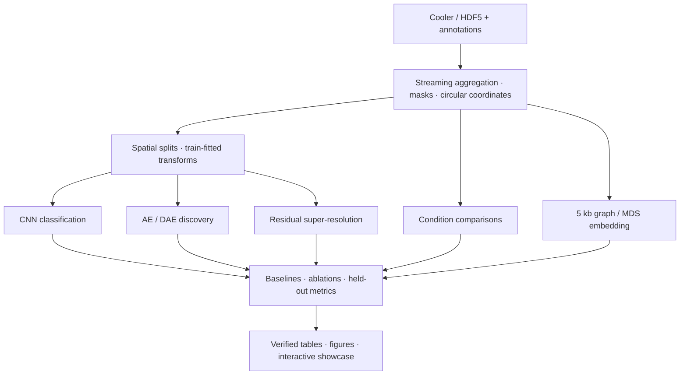

# MicroCTure：技术设计

MicroCTure 是面向大肠杆菌 Micro-C 接触矩阵的 scientific ML 项目。输入是一组记录基因组位置之间接触次数的稀疏矩阵；输出是可比较的模型结果、候选模式、条件差异、超分辨矩阵和三维坐标。

## 核心工程问题

### 1. 数据规模大，局部结构小

两个 WT 输入分别包含约 2.575 亿和 2.497 亿条非零存储记录；基因组长度约 4.64 Mb，原始分辨率为 10 bp。把 464,166 × 464,166 矩阵直接转换为 float32 需要约 862 GB（十进制）。

实现采用 HDF5 分块扫描、稀疏计数聚合和沿对角线的局部接触带。环形坐标支持跨原点窗口；质量掩码与零计数机会保留到后续计算。全基因组三维分析仅在降到 5 kb、929 个 bin 后使用稠密矩阵。

入口：[预处理](../scripts/prepare_data.py)、[局部读取](../scripts/plot_examples.py)、[带状计数](../scripts/discover_task2.py)、[全基因组聚合](../scripts/prepare_task6.py)。

### 2. 滑窗和重复容易造成训练泄漏

不是随机打散图像，而是先按原始基因组足迹分组，再划分 240 / 51 / 53 个结构。同一结构的重复和增强保持相同角色；分类和超分辨分区之间保留 1 kb 隔离。训练区拟合归一化，验证集选择 checkpoint，测试区评价。

三维实验使用传导式边留出：节点共享，训练 / 验证 / 测试边分离。MDS 的填补背景和神经网络邻接图仅由训练边构建。测试包括直接修改留出计数、验证训练输入不受影响的检查。

入口：[空间划分](../scripts/prepare_dataset.py)、[发现模型的训练区统计](../scripts/discovery_v2_core.py)、[三维模型](../scripts/train_task6.py)、[泄漏测试](../tests/test_task6.py)。

### 3. 模型需要对照，结果需要解释

| 模块 | 实现 | 评价 |
|---|---|---|
| 已知结构识别 | 双尺度 CNN、简单特征基线、输入消融 | macro-F1、混淆矩阵、种子波动 |
| 候选发现 | 形态评分、AE / DAE、多尺度扫描与聚类 | 匹配预算、独立位点、跨重复一致性 |
| 条件比较 | 六样本共同有效像素、深度归一化 | 688 次描述性效应量比较 |
| 超分辨 | 双线性 / 双三次、残差 CNN、去残差版本 | PSNR、SSIM、距离分层、已知边界剖面 |
| 三维嵌入 | MDS、距离几何、MDS 初始化的残差图解码器 | 留出距离误差、接触相关、种子稳定性 |

总计 36 次训练 / 拟合：18 次分类 CNN、6 次 AE / DAE、6 次超分辨 CNN、6 次三维优化。聚类的 168 次运行单独计算，不混入训练数。所有模型与种子保留结果，不只展示最佳运行。

## 数据流

## 交付设计

- 参数集中在 `configs/`，源码和输入签名写入实验 manifest，避免混用不同版本结果。
- 独立检查脚本从保存矩阵和坐标重新计算指标，并恢复 checkpoint 验证预测一致。
- 46 项合成测试覆盖坐标、计数守恒、掩码、划分隔离、梯度和几何；CI 不下载真实矩阵。
- `site/` 为无前端依赖的静态展示页，`showcase/` 为显式导出的轻量结果，附 SHA256。
- 原始输入、环境、权重、缓存、完整批量输出与阶段记录保持本地；公开仓库保持可浏览。

这些设计同时覆盖数据工程、PyTorch 模型实现、实验评估与可视化交付。具体结果见 [结果摘要](RESULTS.md)，运行方式见 [复现指南](REPRODUCIBILITY.md)。
